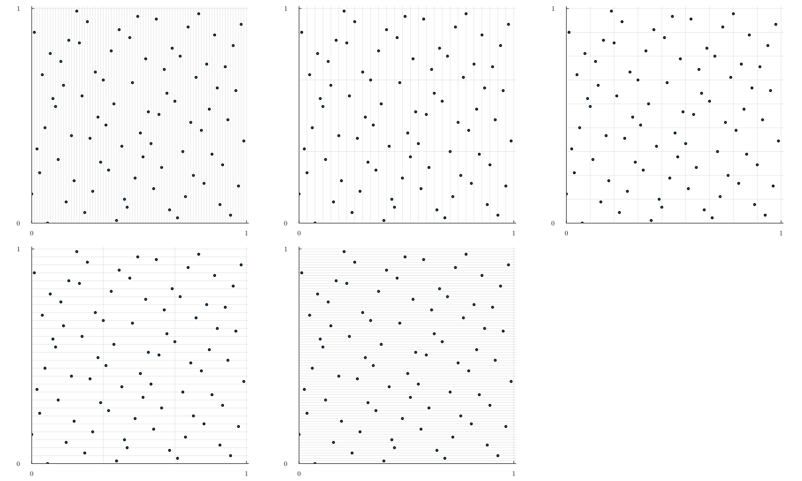

# RandomizedQuasiMonteCarlo

Documentation in construction.
The purpose of this package is to provide randomization method of low discrepancy sequences.

So far only [nested uniform scrambling](https://link.springer.com/chapter/10.1007/978-1-4612-2552-2_19), Cranley Patterson Rotation (shift) and Linear Matrix Scrambling.

Compared to over Quasi Monte Carlo package the focus here is not to generate low discrepancy sequences `(ξ₁, ..., ξₙ)` (Sobol', lattice, ...) but on randomization of these sequences `(ξ₁, ..., ξₙ) → (x₁, ..., xₙ)`.
The purpose is to obtain many independent realizations of `(x₁, ..., xₙ)` by using the functions `shift!`, `scrambling!`, etc.
The original sequences can be obtained for example via the [QuasiMonteCarlo.jl](https://github.com/SciML/QuasiMonteCarlo.jl) package.

The scrambling codes are inspired from Owen's `R` implementation that can be found [here](https://artowen.su.domains/code/rsobol.R).

## Basic Sobol sequences examples

```julia
using RandomizedQuasiMonteCarlo
m = 7
N = 2^m # Number of points
d = 2 # dimension
M = 32 # Number of bit to represent a digit

u_uniform = rand(N, d) # i.i.d. uniform

unrandomized_bits = sobol_pts2bits(m, d, M) # Here I use directly the bit representation for Sobol numbers but I could have use another package to get the Sobol sequence and then convert it to its bit representation.

random_bits = similar(unrandomized_bits)
indices = which_permutation(unrandomized_bits) # This function is used in Nested Uniform Scramble. I
nus = NestedUniformScrambler(unrandomized_bits, indices)
lms = LinearMatrixScrambler(unrandomized_bits)

u_sob = dropdims(mapslices(bits2unif, unrandomized_bits, dims=3), dims=3)
u_nus = copy(u_sob)
u_lms = copy(u_sob)
u_shift = copy(u_sob)

scramble!(u_nus, random_bits, nus)
scramble!(u_lms, random_bits, lms)
shift!(u_shift)

# Plot #
using Plots, LaTeXStrings
# Settings I like for plotting
default(fontfamily="Computer Modern", linewidth=1, label=nothing, grid=true, framestyle=:default)

begin
    d1 = 1
    d2 = 2
    sequences = [u_uniform, u_sob, u_nus, u_lms, u_shift]
    names = ["Uniform", "Sobol (unrandomized)", "Nested Uniform Scrambling", "Linear Matrix Scrambling", "Shift"]
    p = [plot(thickness_scaling=2, aspect_ratio=:equal) for i in sequences]
    for (i, x) in enumerate(sequences)
        scatter!(p[i], x[:, d1], x[:, d2], ms=0.9, c=1, grid=false)
        title!(names[i])
        xlims!(p[i], (0, 1))
        ylims!(p[i], (0, 1))
        yticks!(p[i], [0, 1])
        xticks!(p[i], [0, 1])
        hline!(p[i], range(0, 1, step=1 / 4), c=:gray, alpha=0.2)
        vline!(p[i], range(0, 1, step=1 / 4), c=:gray, alpha=0.2)
        hline!(p[i], range(0, 1, step=1 / 2), c=:gray, alpha=0.8)
        vline!(p[i], range(0, 1, step=1 / 2), c=:gray, alpha=0.8)
    end
    plot(p..., size=(1500, 900))
end
```


Now let say you want to do scrambling in base $b$.

```julia
using QuasiMonteCarlo
using Random
```

 The `InertSampler` is used to obtain a randomized Faure sequences (see [here](https://github.com/SciML/QuasiMonteCarlo.jl/pull/45/files#diff-3b9314a6f9f2d7eec1d0ef69fa76cfabafdbe6d0df923768f9ec32f27a249c63) in the test file).

 ```julia
struct InertSampler <: Random.AbstractRNG end
InertSampler(args...; kwargs...) = InertSampler()
Random.rand(::InertSampler, ::Type{T}) where {T} = zero(T)
Random.shuffle!(::InertSampler, arg::AbstractArray) = arg
```

## Nested uniform or Linear Matrix Scrambling of Faure sequences

 ```julia
m = 4
d = 3
b = QuasiMonteCarlo.nextprime(d)
N = b^m # Number of points
M = m
rng = InertSampler()
faure = permutedims(QuasiMonteCarlo.sample(N, d, FaureSample(rng)))
unrandomized_bits = zeros(Int, N, d, M)
for i in 1:N, j in 1:d
    unrandomized_bits[i, j, :] = unif2bits(faure[i, j], b; M=M)
end

indices = which_permutation(unrandomized_bits, b) #32 bit version
nus = NestedUniformScrambler_b(unrandomized_bits, indices, b)

lms = LinearMatrixScrambler_b(unrandomized_bits, b)

u_sob = dropdims(mapslices(x -> bits2unif(x, b), unrandomized_bits, dims=3), dims=3)
u_nus = copy(u_sob)
u_lms = copy(u_sob)

random_bits_nus = copy(unrandomized_bits) # M bit version
random_bits_lms = copy(unrandomized_bits) # M bit version

Random.seed!(2)
scramble!(u_nus, random_bits_nus, nus)
scramble!(u_lms, random_bits_lms, lms)
```

This plot checks (visually) that you are dealing with `(t,d,m)` sequence i.e. you must see one point per rectangle.

```julia
begin
    d1 = 1 
    d2 = 3
    x = u_lms
    p = [plot(thickness_scaling=2, aspect_ratio=:equal) for i in 0:m]
    for i in 0:m
        j = m - i
        xᵢ = range(0, 1, step=1 / b^(i))
        xⱼ = range(0, 1, step=1 / b^(j))
        scatter!(p[i+1], x[:, d1], x[:, d2], ms=2, c=1, grid=false)
        xlims!(p[i+1], (0, 1.01))
        ylims!(p[i+1], (0, 1.01))
        yticks!(p[i+1], [0, 1])
        xticks!(p[i+1], [0, 1])
        hline!(p[i+1], xᵢ, c=:gray, alpha=0.2)
        vline!(p[i+1], xⱼ, c=:gray, alpha=0.2)
    end
    plot(p..., size=(1500, 900))
end

```


