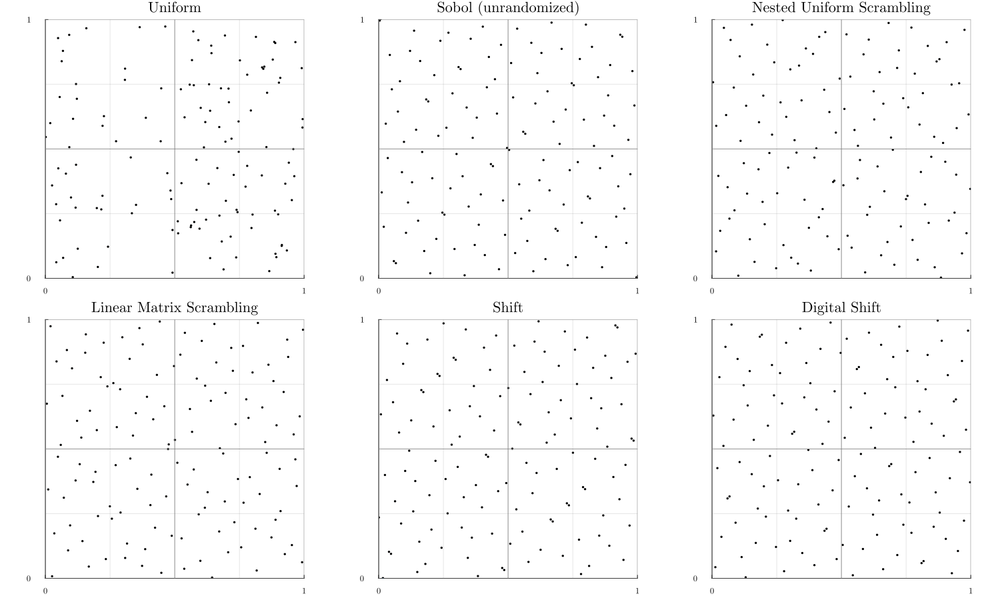

# RandomizedQuasiMonteCarlo
Documentation in construction.
The purpose of this package is to provide randomization method of low discrepancy sequences.

So far only [nested uniform scrambling](https://link.springer.com/chapter/10.1007/978-1-4612-2552-2_19), Cranley Patterson Rotation (shift) and Linear Matrix Scrambling.

Compared to over Quasi Monte Carlo package the focus here is not to generate low discrepancy sequences `ξ₁, ..., ξₙ` (Sobol', lattice, ...) but on randomization of these sequences `ξ₁, ..., ξₙ \to x₁, ..., xₙ`.
The purpose is to obtain many independent realizations of `X₁, ..., Xₙ` by using the functions `shift!`, `scrambling`, etc.

The scrambling code is inspired from Owen's `R` implementation that can be found [here](https://artowen.su.domains/code/rsobol.R).
```julia
using RandomizedQuasiMonteCarlo
m = 7
N = 2^m # Number of points
d = 2 # dimension

u_uniform = rand(N, d) # i.i.d. uniform

unrandomized_bits = sobol_pts2bits(m, d, 32)
indices = sobol_indices(unrandomized_bits) #32 bit version
random_bits = similar(unrandomized_bits) # 32 bit version
nus = NestedUniformScrambler(unrandomized_bits, indices)
lms = LinearMatrixScrambler(unrandomized_bits)

u_sob = dropdims(mapslices(bits2unif, unrandomized_bits, dims=3), dims=3)
u_nus = similar(u_sob)
u_lms = similar(u_sob)

scramble!(u_nus, random_bits, nus)
scramble!(u_lms, random_bits, lms)

# Plot #
using Plots, LaTeXStrings
gr()
plot_font = "Computer Modern"
default(
    fontfamily=plot_font,
    linewidth=1,
    label=nothing,
    grid=true,
    framestyle=:default
)
begin
    d1 = 1
    d2 = 2
    sequences = [u_uniform, u_sob, u_nus, u_lms]
    names = ["Uniform", "Sobol (unrandomized)", "Nested Uniform Scrambling", "Linear Matrix Scrambling"]
    p = [plot(thickness_scaling=2, aspect_ratio=:equal) for i in sequences]
    for (i, x) in enumerate(sequences)
        scatter!(p[i], x[:, d1], x[:, d2], ms=0.9, c=1, grid=false)
        xlabel!(names[i])
        xlims!(p[i], (0, 1))
        ylims!(p[i], (0, 1))
        yticks!(p[i], [0, 1])
        xticks!(p[i], [0, 1])
        hline!(p[i], range(0, 1, step=1 / 4), c=:gray, alpha=0.2)
        vline!(p[i], range(0, 1, step=1 / 4), c=:gray, alpha=0.2)
        hline!(p[i], range(0, 1, step=1 / 2), c=:gray, alpha=0.8)
        vline!(p[i], range(0, 1, step=1 / 2), c=:gray, alpha=0.8)
    end
    plot(p..., size=(1500, 900))
end
```

